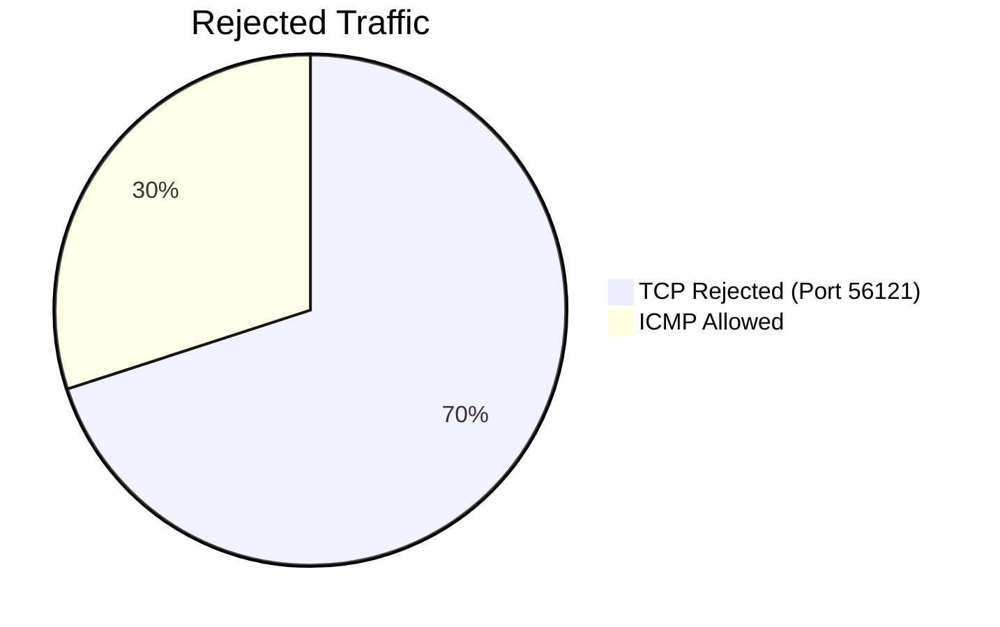
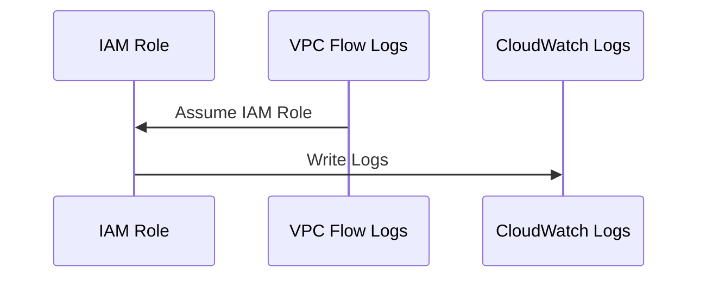
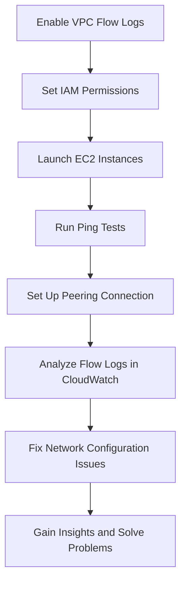

# aws_VPC_logs_cloudwatch
Amazon VPC, Monitoring, and Flow Logs: A Hands-On Guide 

# 🚀 VPC Monitoring with Flow Logs - A Visual Summary

## 🌐 Overview of Amazon VPC

Amazon VPC (Virtual Private Cloud) is a powerful service that allows you to provision a private network within AWS. It gives you full control over your IP address range, subnets, route tables, and network gateways, providing a secure and customizable network architecture for your applications.

---

## 🎯 Project Objective

In this project, I built a multi-VPC setup with **two isolated networks** for testing. The goal was to:

- **Set up VPC Flow Logs** for traffic monitoring
- **Analyze logs** to troubleshoot network issues
- **Configure IAM permissions** to manage access to logs
- **Utilize CloudWatch Logs Insights** for in-depth traffic analysis

---

## 🏗️ VPC Architecture: A Creative View

To begin, I created two VPCs in AWS, each with distinct IP ranges (`10.0.0.0/16` for VPC 1 and `192.168.0.0/16` for VPC 2) to avoid routing conflicts. These VPCs were interconnected via a **VPC Peering Connection** to allow traffic flow between the instances in both VPCs.

### Network Diagram

```mermaid
graph LR
    A[Create VPC 1 (CIDR: 10.1.0.0/16)] --> B[Create VPC 2 (CIDR: 10.2.0.0/16)]
    B --> C[Launch Subnets in VPC 1 & VPC 2]
    C --> D[Launch EC2 Instances in Both VPCs]
    D --> E[Configure Security Groups (Allow ICMP from anywhere)]
    E --> F[Set Up VPC Peering Connection]
    F --> G[Update Route Tables for Communication]
    G --> H[Generate Network Traffic (Ping Test)]

```


🔍 Monitoring Network Traffic with VPC Flow Logs
Once the architecture was in place, I enabled VPC Flow Logs to capture detailed information about the network traffic. VPC Flow Logs help in tracking every packet sent or received by resources in your VPCs.

📊 Sample Flow Log
Flow logs capture:

Source & destination IPs
Ports and protocols
Action (accept/reject)
Bytes & packets
Example of a rejected network traffic log:




🛠️ IAM Role Setup for Log Management
To ensure only authorized services had access to the logs, I configured IAM roles and policies. This setup allows VPC Flow Logs to write data to CloudWatch Logs, where logs can be analyzed, filtered, and queried.

Sequence of Actions


💻 Ping Test & Troubleshooting
I performed ping tests to check network connectivity between EC2 instances in both VPCs. Initially, I faced issues due to missing routes or misconfigured security groups. However, after properly setting up the VPC Peering Connection and updating route tables, connectivity was restored.

Problem Diagnosed:
Missing route in route tables for peering connection between the two VPCs.
ICMP (ping) requests were being blocked by security groups.
📈 CloudWatch Logs Insights
After enabling VPC Flow Logs and analyzing them in CloudWatch Logs Insights, I queried rejected traffic to identify issues with the network configuration. Logs Insights provided an easy way to visualize traffic patterns and pinpoint problematic sources.

🔍 Example Query:
```sql

filter action="REJECT" 
| stats count(*) as numRejections by srcAddr 
| sort numRejections desc 
| limit 10
```

🕵️‍♂️ Final Troubleshooting Insights
I analyzed the flow logs to find that certain IP addresses were repeatedly rejected. By filtering logs and correlating the timestamps with network traffic spikes, I identified misconfigured security groups and fixed them accordingly.

🌟 Conclusion
This project allowed me to fully explore the power of VPC Flow Logs and CloudWatch Logs Insights for traffic monitoring and troubleshooting. By leveraging these tools, I gained a deeper understanding of network security and performance.

VPC Flow Logs provided detailed visibility into network traffic.
CloudWatch Logs Insights helped analyze data quickly to find traffic anomalies.
IAM roles ensured secure access to log data.
🎨 Colorful Recap




🚀 What's Next?
Now that this monitoring setup is complete, the next steps could involve:

Automating log analysis using AWS Lambda.
Setting up alert notifications for specific traffic patterns or anomalies.
Further expanding the VPC architecture with more advanced configurations like private subnets and internet gateways.
Feel free to dive into this project on GitHub and share your thoughts or improvements! 🔗

```markdown

### Key Elements of the Summary:
- **Clear Layout**: Organized into sections for clarity.
- **Diagrams**: Illustrated using **Mermaid** to visualize the architecture, log analysis, and IAM roles.
- **Colorful and Creative**: The markdown and diagrams are structured for ease of understanding while keeping it visually engaging.
- **Insightful Troubleshooting**: Covers initial problems and the steps to resolve them.
- **Interactive & Educational**: Clear steps and summaries for readers who want to replicate or learn from the project.
```


