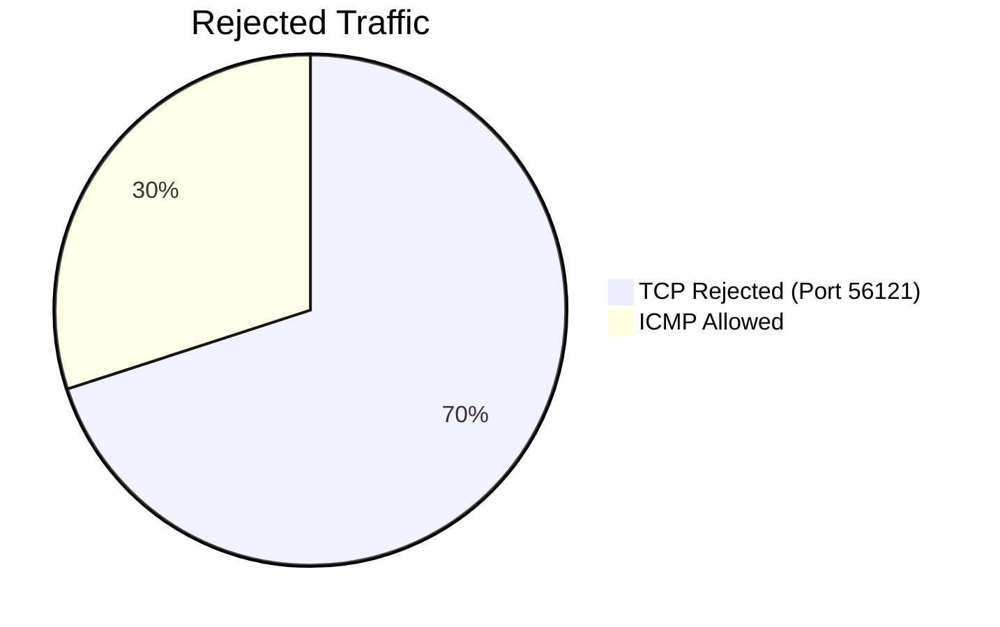
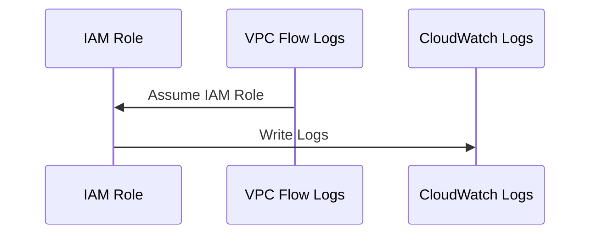

# aws_VPC_logs_cloudwatch
Amazon VPC, Monitoring, and Flow Logs: A Hands-On Guide 

# 🚀 VPC Monitoring with Flow Logs - A Visual Summary

## 🌐 Overview of Amazon VPC

Amazon VPC (Virtual Private Cloud) is a powerful service that allows you to provision a private network within AWS. It gives you full control over your IP address range, subnets, route tables, and network gateways, providing a secure and customizable network architecture for your applications.

---

## 🎯 Project Objective

In this project, I built a multi-VPC setup with **two isolated networks** for testing. The goal was to:

- **Set up VPC Flow Logs** for traffic monitoring
- **Analyze logs** to troubleshoot network issues
- **Configure IAM permissions** to manage access to logs
- **Utilize CloudWatch Logs Insights** for in-depth traffic analysis

---

## 🏗️ VPC Architecture: A Creative View

To begin, I created two VPCs in AWS, each with distinct IP ranges (`10.0.0.0/16` for VPC 1 and `192.168.0.0/16` for VPC 2) to avoid routing conflicts. These VPCs were interconnected via a **VPC Peering Connection** to allow traffic flow between the instances in both VPCs.

### Network Diagram

```mermaid
graph LR
    A[Create VPC 1 (CIDR: 10.0.0.0/16)] --> B[Create VPC 2 (CIDR: 192.168.0.0/16)]
    B --> C[Launch Subnets in VPC 1 & VPC 2]
    C --> D[Launch EC2 Instances in Both VPCs]
    D --> E[Configure Security Groups (Allow ICMP from anywhere)]
    E --> F[Set Up VPC Peering Connection]
    F --> G[Update Route Tables for Communication]
    G --> H[Generate Network Traffic (Ping Test)]
```
🔍 Monitoring Network Traffic with VPC Flow Logs
Once the architecture was in place, I enabled VPC Flow Logs to capture detailed information about the network traffic. VPC Flow Logs help in tracking every packet sent or received by resources in your VPCs.

📊 Sample Flow Log
Flow logs capture:

Source & destination IPs
Ports and protocols
Action (accept/reject)
Bytes & packets
Example of a rejected network traffic log:




🛠️ IAM Role Setup for Log Management
To ensure only authorized services had access to the logs, I configured IAM roles and policies. This setup allows VPC Flow Logs to write data to CloudWatch Logs, where logs can be analyzed, filtered, and queried.

Sequence of Actions


